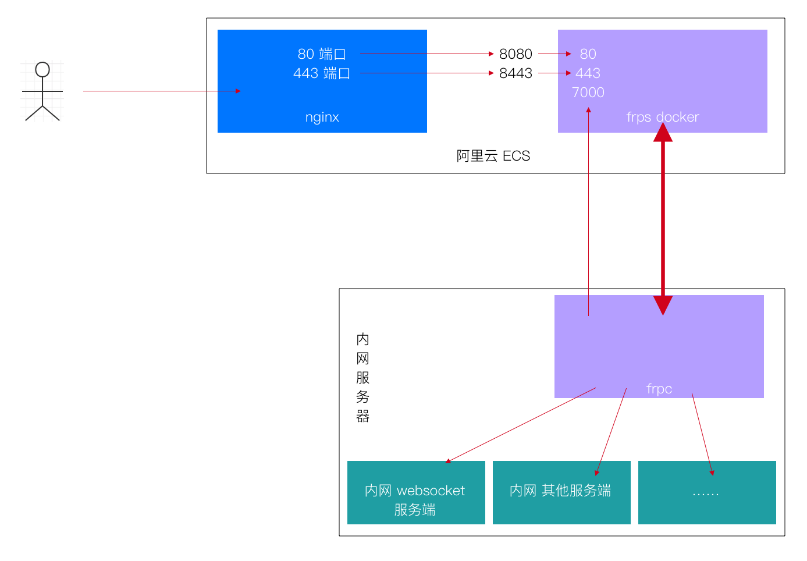

# frp 做内网穿透

[TOC]

## 准备
要做内网穿透，需要一台公网能访问的服务器（我这里使用了 aliyun ECS），一台内网服务器
公网服务器部署：frps 服务端，nginx，docker(安装 docker-compose 命令)
内网服务器部署: frpc 客户端，socket 后端服务程序

## 下载 frp
[官方 github 下载](https://github.com/fatedier/frp/releases)
[官方文档](https://github.com/fatedier/frp)

简单配置，官方已给出示例，这里不做赘述
但是官方的配置不支持直接 wss 的代理（加密 websocket 代理）
我这边研究了一种，解决方案如下，试用可行

## wss 代理配置架构图


实现简要说明：
1 . 在公网服务器上(aliyun ECS) 用 nginx 接收前端请求，nginx 监听的是 80 和 443 端口
2 . 公网服务器用 docker 安装 frp 服务端 frps, docker 转发接口映射 8080:80、8443:443，意思是 8080 端口转发到 docker 的 80 端口，8443 端口转发到 dokcer 的 443 端口
3 . 内网服务器上，frpc 客户端将请求转发到后端 socket 服务程序上

### nginx 配置
```
server {
        listen       80;
        server_name  ws.domain.com; # 配置自己的 wss 域名

        charset utf-8;

        access_log  /var/log/nginx/ws.access.log  main;

		# rewrite ^(.*)$ https://$host$1 permanent;
		rewrite ^(.*)$ https://${server_name}$1 permanent;

        location / {
        	proxy_pass http://x.x.x.x:8080/; # 这里的 x.x.x.x 是自己外网服务器的内网 ip
			proxy_http_version 1.1;
            proxy_set_header Upgrade $http_upgrade;
            proxy_set_header Connection "upgrade";
            proxy_redirect off;
            proxy_set_header Host $host;
            proxy_set_header X-Real-IP $remote_addr;
            proxy_set_header X-Forwarded-For $proxy_add_x_forwarded_for;
            proxy_set_header http_user_agent $http_user_agent;
            proxy_connect_timeout 90;
            proxy_send_timeout 90;
            proxy_read_timeout 90;
            proxy_buffer_size 4k;
            proxy_buffers 4 32k;
            proxy_busy_buffers_size 64k;
            proxy_temp_file_write_size 64k;
            proxy_next_upstream http_502 http_504 http_503 error timeout invalid_header;
	}

        error_page  404              /404.html;

        # redirect server error pages to the static page /50x.html
        #
        error_page   500 502 503 504  /50x.html;
        location = /50x.html {
            root   html;
        }

        # deny access to .htaccess files, if Apache's document root
        # concurs with nginx's one
        #
        #location ~ /\.ht {
        #    deny  all;
        #}
    }

server {
	listen 443 ssl;
	server_name ws.domain.com;
	#ssl on;
	ssl_certificate /usr/local/nginx/cert/ws.domain.com.pem;
	ssl_certificate_key /usr/local/nginx/cert/ws.domain.com.key;
	ssl_session_timeout 5m;
	ssl_ciphers ECDHE-RSA-AES128-GCM-SHA256:ECDHE:ECDH:AES:HIGH:!NULL:!aNULL:!MD5:!ADH:!RC4;
	ssl_protocols TLSv1 TLSv1.1 TLSv1.2;
	ssl_prefer_server_ciphers on;
	location / {
		proxy_pass http://x.x.x.x:8080/; # 同上面一样，这里的 x.x.x.x 是自己外网服务器的内网 ip
		proxy_http_version 1.1;
		proxy_set_header Upgrade $http_upgrade;
		proxy_set_header Connection "upgrade";
		proxy_redirect off;
		proxy_set_header Host $host;
		proxy_set_header X-Real-IP $remote_addr;
		proxy_set_header X-Forwarded-For $proxy_add_x_forwarded_for;
		proxy_set_header http_user_agent $http_user_agent;
		proxy_connect_timeout 90;
		proxy_send_timeout 90;
		proxy_read_timeout 90;
		proxy_buffer_size 4k;
		proxy_buffers 4 32k;
		proxy_busy_buffers_size 64k;
		proxy_temp_file_write_size 64k;
		proxy_next_upstream http_502 http_504 http_503 error timeout invalid_header;
	}
}
```

### frps.ini 配置
```
[common]
bind_port = 7000
vhost_http_port = 80
vhost_https_port = 443
```
启动 frps 服务端
```
./frps -c frps.ini
```

### frps 的 docker-compose.yml 文件配置
```
version: "3"
services:
  frp:
    image: 2050610398/frp:latest
    container_name: frp
    ports:
      - 7000:7000
      - 8080:80
      - 8443:443
    volumes:
      - ./frps.ini:/srv/frps.ini
    command: /srv/frps -c /srv/frps.ini
    restart: always
```
启动 frp docker
```
docker-compose -f docker-compose.yml -d
```

### frpc.ini 配置
```
[common]
server_addr = x.x.x.x   # 这里配置的是阿里云买的公网服务器的外网 ip
server_port = 7000
log_file = console
log_level = trace
log_max_days = 7

[ws_domain_http]   # 名字可以随意起
type = http
local_port = 8083
custom_domains = ws.domain.com # wss 的域名
```
启动 frpc 客户端
```
./frpc -c frpc.ini
```
